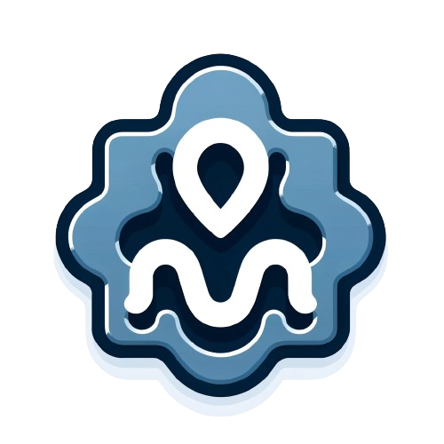

<!-- Improved compatibility of back to top link: See: https://github.com/othneildrew/Best-README-Template/pull/73 -->
<a name="readme-top"></a>
<!-- PROJECT LOGO -->
<br />
<div align="center">
  <a href="https://github.com/github_username/repo_name">
    
  </a>

<h3 align="center">Simple C++ Cookiecutter</h3>

  <p align="center">
    This repository contains a simple C++ project template for Cookiecutter that I use for most of my C++ projects.
    <br />
    <br />
    <br />
    <a href="https://github.com/gokulp01/minimal-cpp-cookiecutter/issues">Report Bug</a>
    ·
    <a href="https://github.com/gokulp01/minimal-cpp-cookiecutter/issues">Request Feature</a>
  </p>
</div>


<!-- TABLE OF CONTENTS -->
<details>
  <summary>Table of Contents</summary>
  <ol>
    <li>
      <a href="#about-the-project">About The Project</a>
      <ul>
        <li><a href="#built-with">Built With</a></li>
      </ul>
    </li>
    <li>
      <a href="#getting-started">Features</a>
      <ul>
        <li><a href="#prerequisites">Prerequisites</a></li>
      </ul>
    </li>
    <li><a href="#usage">Usage</a></li>
    <li><a href="#roadmap">Roadmap</a></li>
    <li><a href="#contributing">Contributing</a></li>
    <li><a href="#license">License</a></li>
    <li><a href="#contact">Contact</a></li>
  </ol>
</details>


<!-- ABOUT THE PROJECT -->
## About The Project
This is a very simple kickstarter cookiecutter for cpp projects and research work for quick prototyping and implementations. 
<p align="right">(<a href="#readme-top">back to top</a>)</p>


### Built With

* CMake
* Catch
* Cookiecutter

<p align="right">(<a href="#readme-top">back to top</a>)</p>


<!-- GETTING STARTED -->
## Features
- Simple C++ project structure
- CMake build system
- Catch for unit tests
- Cookiecutter for project creation
- Git for version control
- GitHub for hosting


### Prerequisites

#### CMake
To install CMake on your system, follow these steps:

For macOS:
```
brew install cmake
```
For Ubuntu:
```
sudo apt-get update
sudo apt-get install cmake
```
For Windows:
```
For Windows, download and run the installer from the [CMake official website](https://cmake.org/download/).
```

#### Cookiecutter
To install Cookiecutter, you need Python installed on your system. Then, you can install Cookiecutter using pip:
  ```sh
pip install cookiecutter
  ```


<p align="right">(<a href="#readme-top">back to top</a>)</p>


<!-- USAGE EXAMPLES -->
## Usage

### Usage

To create a new C++ project using this template, follow these steps:

1. Open your terminal.
2. Navigate to the directory where you want to create your project.
3. Run the following command:
   ```
   cookiecutter gh:gokulp01/minimal-cpp-cookiecutter
   ```
5. Cookiecutter will prompt you to enter values for various options, such as the project name, project slug, author's name, etc. Input your desired values for these fields.
6. Once you complete the prompts, Cookiecutter will create a new directory containing the scaffolded C++ project based on the values you provided.
7. Navigate into your new project directory: cd your-project-slug - Replace `your-project-slug` with the project slug you provided during the setup.
8. Now, you can begin working on your C++ project. The directory will contain a basic project structure, including source files, a CMake configuration file, and any additional boilerplate specified in your template.
9. To build your project, you can use CMake as follows: mkdir build && cd build && cmake .. && make - This will compile your C++ project and generate executable files in the `build` directory.

By following these steps, you can quickly bootstrap a new C++ project using the simple cookie-cutter template. Your folder tree should look like this
```bash
├── CMakeLists.txt
├── bin
├── build
├── main.cpp
├── src
│   ├── myclass.cpp
│   └── myclass.hpp
└── tests
    ├── CMakeLists.txt
    ├── SmokeTests.cpp
    ├── bin
    ├── build
    └── catch.hpp
```


<p align="right">(<a href="#readme-top">back to top</a>)</p>


<!-- ROADMAP -->
## Roadmap

- [ ] Add support for Travis CI
- [ ] Add support for AppVeyor
- [ ] Add support for Conan
- [ ] Add support for Doxygen
- [ ] Add support for Cppcheck


<p align="right">(<a href="#readme-top">back to top</a>)</p>


<!-- CONTRIBUTING -->
## Contributing

Contributions are what make the open source community such an amazing place to learn, inspire, and create. Any contributions you make are **greatly appreciated**.

If you have a suggestion that would make this better, please fork the repo and create a pull request. You can also simply open an issue with the tag "enhancement".
Don't forget to give the project a star! Thanks again!

1. Fork the Project
2. Create your Feature Branch (`git checkout -b feature/AmazingFeature`)
3. Commit your Changes (`git commit -m 'Add some AmazingFeature'`)
4. Push to the Branch (`git push origin feature/AmazingFeature`)
5. Open a Pull Request

<p align="right">(<a href="#readme-top">back to top</a>)</p>


<!-- LICENSE -->
## License

Distributed under the MIT License. See `LICENSE.txt` for more information.

<p align="right">(<a href="#readme-top">back to top</a>)</p>


<!-- CONTACT -->
## Contact

Your Name - [@twitter_handle](https://twitter.com/gokulp01) - gokulp2@illinois.edu/gokulgns@gmail.com


<p align="right">(<a href="#readme-top">back to top</a>)</p>


<!-- MARKDOWN LINKS & IMAGES -->
<!-- https://www.markdownguide.org/basic-syntax/#reference-style-links -->

[CMake-logo]: https://img.shields.io/badge/CMake-%23008FBA.svg?style=for-the-badge&logo=cmake&logoColor=white
[CMake-url]: https://cmake.org/
[contributors-shield]: https://img.shields.io/github/contributors/github_username/repo_name.svg?style=for-the-badge
[contributors-url]: https://github.com/github_username/repo_name/graphs/contributors
[forks-shield]: https://img.shields.io/github/forks/github_username/repo_name.svg?style=for-the-badge
[forks-url]: https://github.com/github_username/repo_name/network/members
[stars-shield]: https://img.shields.io/github/stars/github_username/repo_name.svg?style=for-the-badge
[stars-url]: https://github.com/github_username/repo_name/stargazers
[issues-shield]: https://img.shields.io/github/issues/github_username/repo_name.svg?style=for-the-badge
[issues-url]: https://github.com/github_username/repo_name/issues
[license-shield]: https://img.shields.io/github/license/github_username/repo_name.svg?style=for-the-badge
[license-url]: https://github.com/github_username/repo_name/blob/master/LICENSE.txt
[linkedin-shield]: https://img.shields.io/badge/-LinkedIn-black.svg?style=for-the-badge&logo=linkedin&colorB=555
[linkedin-url]: https://linkedin.com/in/linkedin_username
[product-screenshot]: images/screenshot.png
[Next.js]: https://img.shields.io/badge/next.js-000000?style=for-the-badge&logo=nextdotjs&logoColor=white
[Next-url]: https://nextjs.org/
[React.js]: https://img.shields.io/badge/React-20232A?style=for-the-badge&logo=react&logoColor=61DAFB
[React-url]: https://reactjs.org/
[Vue.js]: https://img.shields.io/badge/Vue.js-35495E?style=for-the-badge&logo=vuedotjs&logoColor=4FC08D
[Vue-url]: https://vuejs.org/
[Angular.io]: https://img.shields.io/badge/Angular-DD0031?style=for-the-badge&logo=angular&logoColor=white
[Angular-url]: https://angular.io/
[Svelte.dev]: https://img.shields.io/badge/Svelte-4A4A55?style=for-the-badge&logo=svelte&logoColor=FF3E00
[Svelte-url]: https://svelte.dev/
[Laravel.com]: https://img.shields.io/badge/Laravel-FF2D20?style=for-the-badge&logo=laravel&logoColor=white
[Laravel-url]: https://laravel.com
[Bootstrap.com]: https://img.shields.io/badge/Bootstrap-563D7C?style=for-the-badge&logo=bootstrap&logoColor=white
[Bootstrap-url]: https://getbootstrap.com
[JQuery.com]: https://img.shields.io/badge/jQuery-0769AD?style=for-the-badge&logo=jquery&logoColor=white
[JQuery-url]: https://jquery.com 


